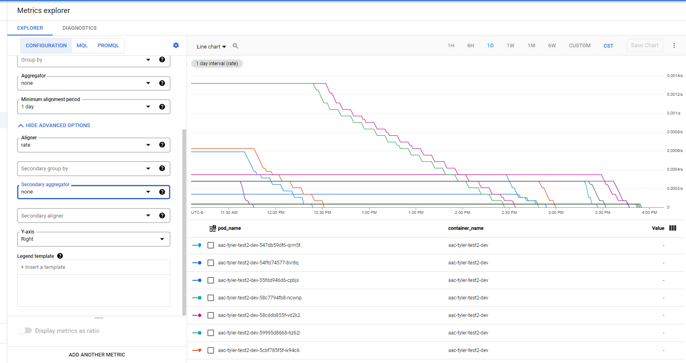

# Log-Based Metrics and Notifications

To create alerts in Slack for log-based metrics, you will need to setup the following components:
- **Log-Based Metric:** Tracks certain resources or information in a GCP project based on its log entries
- **Slack Channel and Email:** The Slack channel will listen to a specific email address, and create notifications based on messages sent to that email
- **Notification Channel:** Defines how Cloud Monitoring will notify your team when an alert policy fires
- **Metric-Based Alert Policy:** Monitors the performance of a metric, and will "fire" if the metric violates a condition defined by the policy.
If a notification channel is selected, then the policy will trigger a notification as defined by the channel.


## Creating a Log-Based Metric
A log-based metric can be created by deploying a `LoggingLogMetric` object through Kubernetes. A sample `.yaml` configuration file is provided below, it can be copied onto your local machine
and edited. You can then deploy the metric from your local Cloud SDK Shell using the `kubectl apply -f <yaml config file>` command.

The properties of this `.yaml` file are described in [this reference doc](https://cloud.google.com/config-connector/docs/reference/resource-docs/logging/logginglogmetric), though we make
note of a couple of details:
- `metadata.name`: Identifier for the metric, used as a reference for `metric.type` in the [alert policy](#creating-a-metric-based-alert-policy)
- `spec.filter`: Pattern that determines which log messages the metric will track. In the example below: we are tracking ERROR messages from a Kubernetes container instance under the
`frameworks-arch-as-code` namespace, in the project `cdo-gke-private-np-1a8686`. Refer to
[this document](https://cloud.google.com/monitoring/api/resources#generated) for a full list of monitored resource types.
- `spec.labelExtractors`: A map from a label key string to an extractor expression which is used to extract data from a log entry field and assign as the label value. you can find more
information [here](https://cloud.google.com/config-connector/docs/reference/resource-docs/logging/logginglogmetric)
- The values for `spec.metricDescriptor.metricKind` and `valueType` are described [here](https://cloud.google.com/monitoring/api/ref_v3/rest/v3/projects.metricDescriptors#MetricKind)

```
apiVersion: logging.cnrm.cloud.google.com/v1beta1
kind: LoggingLogMetric
metadata:
  name: send-smtp-proxy-error-count
spec:
  filter: "resource.type=k8s_container AND resource.labels.namespace_name=\"send-smtp-proxy\" AND severity=ERROR"
  labelExtractors:
   invalidcred: REGEXP_EXTRACT(jsonPayload.message, "/Invalid credentials for relay/([A-z0-9]+)$")
  metricDescriptor:
    displayName: "send-smtp-proxy-error-count"
    metricKind: "DELTA"
    valueType: "INT64"
    labels:
    - description: "Filter for IP error"
      key: "invalidcred"
      valueType: "STRING"
  projectRef:
    external: "projects/cdo-gke-private-np-1a8686"
```

**NOTE**: The  `spec.labelExtractors`and `spec.metricDescriptor.labels.key` needs to match (see example above).
## Creating a Slack Email for Notifications
In order to recieve notifications on Slack via email, you need to follow the steps below in Slack:
- Create a Slack channel or use an existing one
- Click on the dropdown next to the channel name at the top, and select "Integrations"
- Select "Send emails to this channel" and copy the email address generated (you will use this in the notification channel)
- Please note that the notifications will be sent to this particular channel

## Creating a Notification Channel
In order to create a notification channel, a terraform file will need to be added into the [CIO Stackdriver project](https://github.com/telus/tf-infra-cio-stackdriver). Once you pull the repo to your local machine, open up the `terraform/notification` folder and create a terraform file. Refer to [this terraform file (framework-arch-as-code-support-notification.tf)](https://github.com/telus/tf-infra-cio-stackdriver/blob/master/terraform/notification/framework-arch-as-code-support.tf).
- Note that you need to deploy the notification before creating the policy.
- The `email_address` attribute should be set to the email address generated by Slack
- You need to test in dev environment before deploying to production. In order to do this, just add the `count` argument with this value `var.env == "np" ? 1 : 0` index in the module.
- You're required to use the terraform CIO module for notification [notification-channels](https://github.com/telus/tf-module-gcp-notification-channel).  When creating a google_monitoring_notification_channel with a module, you can use the template provided in the doc.
- It is highly recommended that you read and understand all the README before starting out.

## Creating a Metric-Based Alert Policy
To create a policy that will monitor your metric, a terraform file will need to be added into the [CIO Stackdriver project](https://github.com/telus/tf-infra-cio-stackdriver). It is highly
recommended that you read and understand the README.
- Refer to [this terraform file (framework-arch-as-code-policy.tf)](https://github.com/telus/tf-infra-cio-stackdriver/blob/master/terraform/policy/framework-arch-as-code-policy.tf)
as an example
  - Note that `metric.type` in the `filter` refers to the value of `metadata.name` in the [metric configuration file (see example)](#creating-a-log-based-metric)
  - `resource.type` must be in the `filter` even if the [metric configuration file](#creating-a-log-based-metric) already includes this filter, otherwise `terrafrom apply` will error out
  - As per the README, the `count` argument and `[0]` index in the `notif_id` were added to prevent production deployment
- Descriptions for the arguments in the alert policy module can be found in [this README](https://github.com/telus/tf-module-gcp-alert-policy)
- Variable definitions for the policy file are defined [here](https://github.com/telus/tf-infra-cio-stackdriver/blob/master/terraform/policy/np/framework-arch-as-code-auto.tfvars)
- Please read [Resource: AlertPolicy](https://cloud.google.com/monitoring/api/ref_v3/rest/v3/projects.alertPolicies#resource:-alertpolicy) document to understand the parameters needed to 
create a policy.

## Contributing to the [CIO Stackdriver project](https://github.com/telus/tf-infra-cio-stackdriver)
To contribute to the repo:
- Create a branch or forked repo.
- Once the terraform files are added, create a pr and wait the the CDO Team to review.
- If there are no issues, the pr will be merged.

## Use the GCP console to explore your metrics
Once your policies are created you can use the [Metric explorer](https://console.cloud.google.com/monitoring/metrics-explorer) to see here your rendered logging metrics and can fine tune your alert policy code by modify the inputs in the UI, this is a powerful tool to improve your metrics .



Also you can see your policies in [GCP Console Monitoring](https://console.cloud.google.com/monitoring/alerting/policies).
