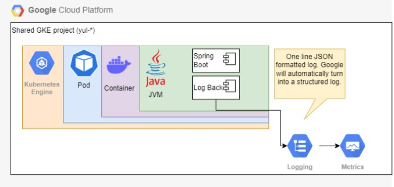

# **Logging**

For implemeting logging within your Java project, the recommended framework is logback. Logback is intended as a successor to the popular log4j project. You can find additional details about Logback [here](https://logback.qos.ch/).

It is recommended to use The Simple Logging Facade for Java (SLF4J). It abstracts the underlying logging frameworks, giving us the ability to swap implementations with zero code impact. [SLF4J Manual](https://www.slf4j.org/manual.html)

As part of the sample app and template, the logback java package is used to demonstrate logging.

## **Setting the Active Spring Profile**

The [Environment Configuration](env-config.md) document briefly explains the role of Spring profiles in this sample app. As far as logging is concerned,
the profiles correspond to the following configurations in [logback-spring.xml](../src/main/resources/logback-spring.xml):
* `default` - logs are printed to the console of the running machine as human-readable ("pretty") JSON.
* `test`, `dev`, `st`, and `pr` - logs are printed to the console of the running machine as single-line JSON.

To choose a specific profile, set the `SPRING_PROFILES_ACTIVE` environment variable to the name of the desired profile. For example, to select the `dev` profile:
```bash
# On a -nix based OS
> export SPRING_PROFILES_ACTIVE=dev

# In a Windows Powershell terminal
> $Env:SPRING_PROFILES_ACTIVE="dev"
```


## **Centralized Logging**
Google’s Cloud Logging will be our centralized logging platform. To send log messages to Google Cloud:
- If you are running in a Kubernetes Engine, App Engine, GCE, Cloud Run, Cloud Functions, then logs to STDOUT or STDERR are automatically sent to Cloud Logging.

- If you are running outside of Google Cloud runtime environment, e.g., from on-premise datacenter, or another cloud, you can:
    - Use the Cloud Logging API to send log entries to Cloud Logging
    - Use a Logging Agent
    - Use a Fluend adapter

## **Logging Format**

It’s recommended to use standardized date format within the logs, and UTC time zone.
```2022-03-24 18:55:26.124```

## **Logging Format on GCP**

Logs sent to GCP Logging are formatted as single-line structured JSON, which allows us to query and perform analysis much more efficiently on GCP. This sample app uses an appender included in [logback-spring.xml](../src/main/resources/logback-spring.xml) to do this.

Alert policies based on log-based metrics are defined in central stackdriver project: https://github.com/telus/tf-infra-cio-stackdriver 

## **GCP Logging Architecutre**



## **Finding Log Messages in GCP**
For this example, assume we have sent a WARNING message via the sample app webpage. To view the log entry in GCP console, click on the Navigation Menu at the top-left and scroll down to the Logging Service.


By default, the entries are found under the "Global" resource type, with log name "spring.log". You may also find it under the "Warning" severity filter. If the log is recent enough, you may be able to find it without any filter.


Expanding the log entry, we see the following fields:


## **Logging Format on Local**

The `local` profile outputs logs to the console in the following format:
```
{
  "timestamp" : "2022-03-24 18:55:26.124",
  "level" : "WARN",
  "thread" : "http-nio-8080-exec-2",
  "mdc" : {
    "traceId" : "1a4686d676adc4c0",
    "spanId" : "1a4686d676adc4c0"
  },
  "logger" : "com.telus.samples.logging.LoggingController",
  "message" : "This is a sample warning message",
  "context" : "default"
}
```