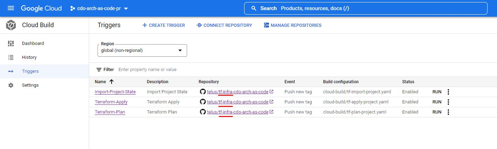

# Production Deployment
Once the application is tested and verified in the Non-Production Environment, the app is ready to be promoted into the **Production** Environment. This document will
guide you through the whole **Production** deployment process.

## Update Configuration Files
Before starting the deployment, make sure that the values in your [Production configuration files](env-config.md) (i.e. the `pr` environment) are correct (this includes
your `pr` helm chart.)

## Create Production Secrets
If your application expects secrets in your Production GCP project, make sure they have been created in the Production project's Secret Manager. You can access the Secret Manager through the GCP console -
under **Navigation Menu > Security > Secret Manager**, then click the **Create Secret** button to get started (assuming you have the permissions to do so.)

## Terraform Configuration for Production
By default, the terraform files in your `tf-infra` repo are used to deploy GCP resources to both Non-Production and Production projects. Ensure that any Production-specific values are set in your `pr.tfvars` file.

For Cloud Storage buckets, the bucket names in Production must not collide with the names in Non-Production. One way to prevent this is to parametrize the bucket names by appending `${var.env}` to the `name` of the bucket `resource` - then the bucket names in Non-Production will end in `np`, while the ones in Production will end in `pr`.

```
resource "google_storage_bucket" "some-bucket" {
  ...
  name                        = "a-bucket-name_${var.env}"
  ...
}
```

If you are using this [GCP storage module](https://github.com/telus/tf-module-gcp-storage), append `${var.env}` to the `bucket_name` property.

```
module "some-bucket" {
  ...
  bucket_name    = "dlp_inspect_source_bucket_${var.env}"
  ...
}
```

Once you have pushed your terraform updates (if any), go to the GCP console of your Production project and navigate to **Navigation Menu > Cloud Build > Triggers**. Ensure that the Terraform Plan, Apply, and Import triggers are linked to your `tf-infra` repo.



To run `terraform plan` on your Production project, create a new release in your `tf-infra` repo with a tag ending in `-pr.plan.v<X.Y>` (where `<X.Y>` is the next available version number, e.g. `1.3`.) Check the logs in Cloud Build to make sure the desired configuration is reported. Create another release in your `tf-infra` repo with a tag ending in `-pr.v<X.Y>` (`plan` is not in the tag this time) to run `terraform apply`; this step will actually deploy your GCP resources to the Production project.

## First Time GKE Production Workload Identity Support
If no apps have ever been deployed to the Production project before, open the Production helm chart `helm/...-pr.yaml` in your application's repo. Uncomment the `rbac`
section, then:
- Set the `create` property to `true`
- Replace the `gcp-service-account` with the account corresponding to your production project - this should be `gsa-<project name>@<project id>.iam.gserviceaccount.com`
- Replace the `serviceAccountName` with the `ksa-name` defined in the workload identity module of your `tf-infra` repo. Our example `ksa-name` happens to be called `default`,
check your `tf-infra` repo for your proper `ksa-name`


## Promote release from Non-Production Environment to Production Environment
The promotion of a Production release requires your application to be deployed on GKE Non-Production first
([click here for the guide](../README.md#including-cicd-for-your-api).)

1. Go to **Navigation Menu > Cloud Deploy** in your **Non-Production** GCP project and choose your deployed delivery pipeline.
2. You can choose either your **Dev** version or **Staging** version to be promoted. Click the corresponding **Promote** button.


3. Once the button is clicked, a pop-up page will show all the promotion details. Make sure that the **Target** is `pr`, and by default it would promote the latest deployed version of the pipeline you chose. Click **Deploy**/**Redeploy** button once you confirm all the details. 


4. Since Production release requires approval, click on the three dots beside the release that are under **Pending for Approval** status, and click **Approve/reject latest rollout**


5. Approve this rollout once all the details are confirmed. Once your application is in the Production environment - you may test your application by port-forwarding
(same steps as in the Non-Production environment.)


