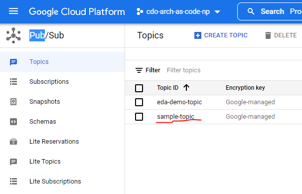
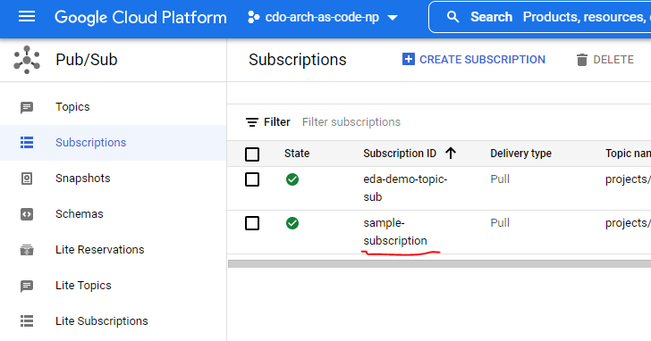

## **Cloud Pub/Sub Demo**

On the index page of this sample application, you will find a demo for publishing to and receiving from a Google Cloud Pub/Sub topic and subscription.
You can check the list of available topics/subscriptions for your project in the GCP console, in **Navigation Menu > Pub/Sub**.
This demo assumes that the topic and subscription you will be using has already been created, and that you have gone through
[your local/codespaces setup](../README.md#select-your-development-environment).




The sample [PubSubController](../src/main/java/com/telus/samples/pubsub/PubSubController.java) uses the topic and subscription name stored in
[application.properties](../src/main/resources/application.properties), in the property *example.pubsub.topic_name* and *example.pubsub.subscription_name*. If the current value of that
property does not match the name in GCP, then overwrite that property with the correct name. As an example, if *sample-topic*
is the name of the topic we wish to use - then in the application.properties file, we should have:
```
# Name of the topic to be used in the sample app
example.pubsub.topic_name=sample-topic
```