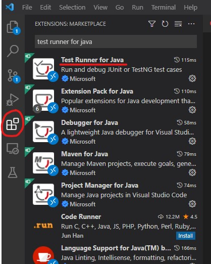
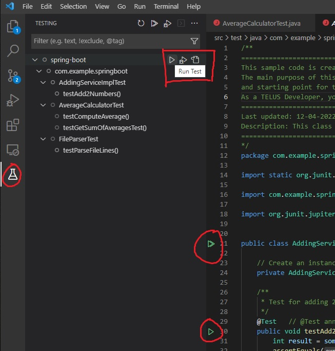

# **Unit Testing**

This sample application uses JUnit 5 unit testing framework to execute unit tests. Mockito is used for mocking dependencies in test classes.
Visit the following links for more information about [JUnit 5](https://github.com/junit-team/junit5/) or [Mockito](https://github.com/mockito/mockito).

## **Executing Unit Tests through Maven (Recommended for Codespaces Development)**

Due to issues with the **Test Runner for Java** extension in Codespaces, we recommend running your unit tests through Maven when developing in
Codespaces (these steps will also work on your local environment as well.) In your console, `cd` to your project directory. To run all unit tests,
enter the command:
```
mvn test
```
To run all tests in a specific unit test class:
```
mvn test -Dtest=<your test class name>
```
Note that `-Dtest` takes the name of the test class, and not the path to the test class file. So to run
[AddingServiceImplTest.java](../src/test/java/com/telus/samples/AddingServiceImplTest.java), we simply enter:
```
mvn test -Dtest=AddingServiceImplTest
```
To run a specific test method in a test class, use `#` to specify the method name after the class name. For example, to run testComputeAverage()
in [AddingServiceImplTest.java](../src/test/java/com/telus/samples/AddingServiceImplTest.java):
```
mvn test -Dtest=AddingServiceImplTest#testComputeAverage
```
As a side note, `mvn package` will also run unit tests as part of its execution.

## **Executing Unit Tests in VSCode Editor**

On your local environment, you can run unit tests directly in VSCode. Make sure you have the **Test Runner for Java** extension installed in your editor.



You can run unit tests at different levels of granularity using the **Testing** explorer UI (the flask icon on the left-most bar.)
You can also run tests using the "play" icons left of the line numbers in the text editor.



## **Creating Unit Tests**

The `@Test` annotation lets JUnit 5 know which methods should be executed for unit testing - and JUnit's `Assertions` API can be called to test the
correctness of returned values from an object's methods. These tools are enough to write the simplest of unit test methods, such as
[AddingServiceImplTest.java](../src/test/java/com/telus/samples/AddingServiceImplTest.java) or
[FileParserTest.java](../src/test/java/com/telus/samples/FileParserTest.java).

We can extend JUnit 5's basic behaviour with the `@ExtendWith` annotation. For example in
[AverageCalculatorTest.java](../src/test/java/com/telus/samples/AverageCalculatorTest.java), we use the annotation to add mocking to our unit
tests (using Mockito.) The `@Mock` annotation lets Mokito know which object references should be mocked. We call `Mockito.when().thenReturn()`
to stub methods with preset return values. `@BeforeEach` is run before each test method is executed in a test class - this is useful for resetting
mocks/objects so that state changes in earlier tests do not affect later tests.
